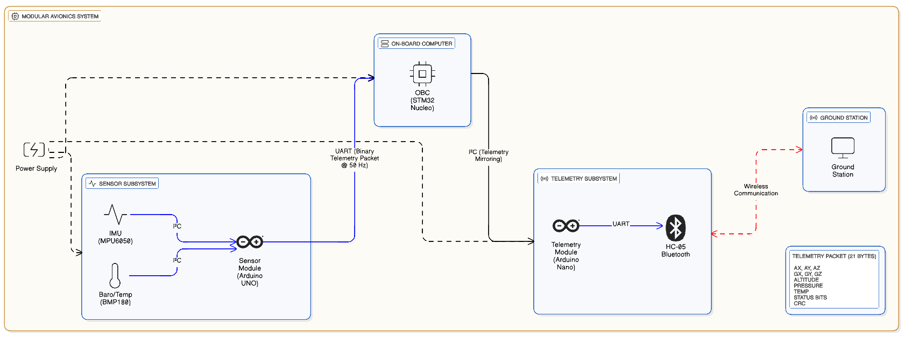
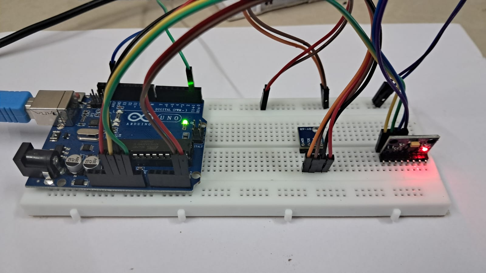
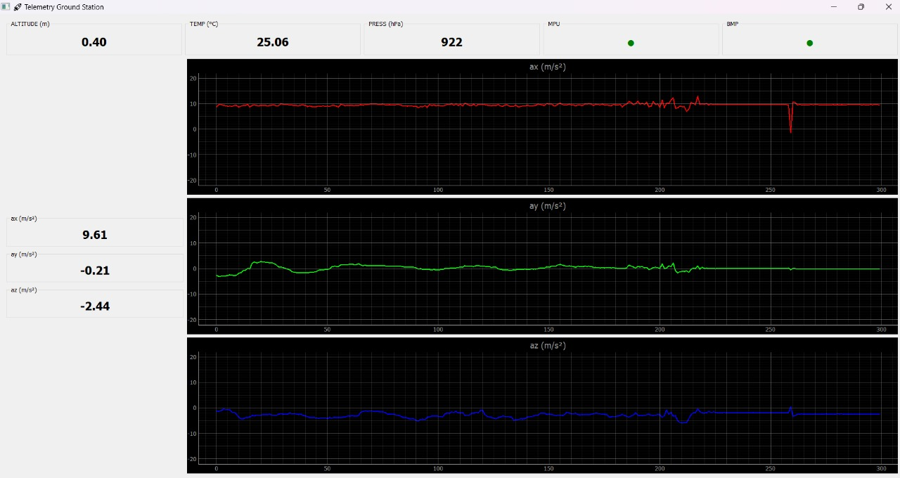

# Modular Avionics System – Telemetry & Data Handling

This project implements a **modular avionics-style telemetry system** inspired by
small launch vehicle and sounding rocket architectures.

The system is designed around **clear separation of responsibilities**, deterministic
data flow, and fault isolation between subsystems.

---

## System Overview

The avionics stack is composed of three independent subsystems:

- **Sensor Subsystem** – Dedicated sensor acquisition
- **On-Board Computer (OBC)** – Central data handling and routing
- **Telemetry Subsystem** – Non-critical wireless downlink
- **Ground Station** – Live visualization and monitoring
## 🎥 Telemetry Demo

---

## 🧩 Subsystem Description

### 1. Sensor Subsystem
**Hardware**
- Arduino UNO (ATmega328P)
- MPU6050 (IMU)
- BMP180 (Barometer + Temperature)

**Responsibilities**
- Periodic sensor sampling
- Unit scaling and normalization
- Binary telemetry packet construction
- Sensor health monitoring

**Interfaces**
- I²C → Sensors
- UART → OBC (binary telemetry packet @ 50 Hz)
  

---

### 2. On-Board Computer (OBC)
**Hardware**
- STM32 Nucleo (Cortex-M4)

**Responsibilities**
- Central data handling
- Telemetry packet reception and validation
- CRC checking
- Telemetry mirroring
- Onboard SD card data logging (SPI + FATFS)

**Interfaces**
- UART ← Sensor Subsystem
- I²C → Telemetry Subsystem
- SPI → SD Card
- USB UART → Debug
- 

---

### 3. Telemetry Subsystem
**Hardware**
- Arduino Nano
- HC-05 Bluetooth Module

**Responsibilities**
- Receive telemetry from OBC
- Forward data wirelessly to ground station
- Operates independently of OBC and sensors

**Note**
Telemetry is **non-critical** and does not affect onboard operation.

---

##  Telemetry Packet Format

**Packet Size:** 21 bytes  
**Rate:** 50 Hz  
**Encoding:** Binary, little-endian

| Field | Description |
|----|----|
| Header | 0xAA |
| ax, ay, az | Accelerometer (m/s² × 100) |
| gx, gy, gz | Gyroscope (deg/s × 100) |
| altitude | Barometric altitude (m × 100) |
| pressure | Pressure (hPa) |
| temperature | Temperature (°C × 100) |
| status | Sensor health bits |
| CRC | XOR checksum |

---

##  Ground Station

A Python-based ground station provides:
- Live plots of ax, ay, az
- Altitude, pressure, temperature display
- Sensor health indicators
- CRC-validated telemetry decoding

Built using:
- PyQt5
- PyQtGraph
- PySerial

---

## Design Philosophy

- Modular, fault-isolated subsystems
- Deterministic data flow
- Clear protocol boundaries
- Telemetry treated as optional, non-critical
- Inspired by real avionics system architecture

---

## Future Extensions
- Data Logger
- Command uplink (ground → OBC)
- Fault detection & isolation (FDIR)
- Redundant telemetry paths
- Actuator / control subsystem integration
